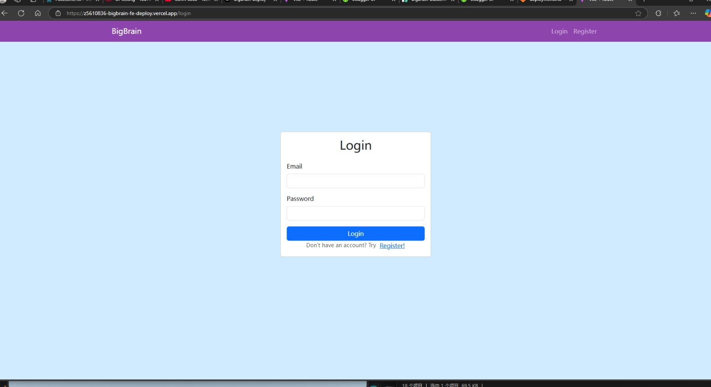
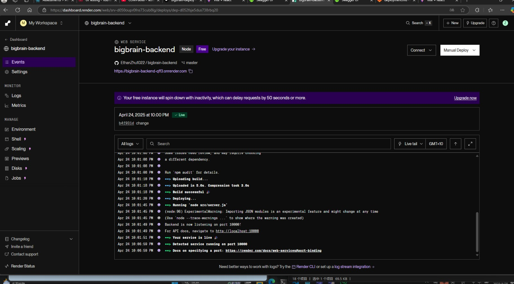
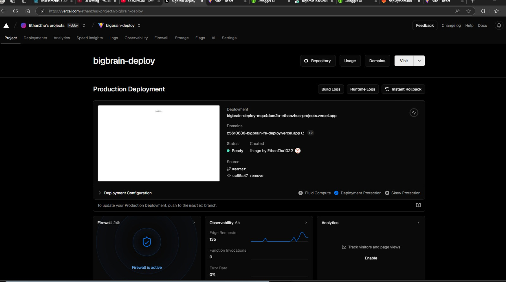

# Bonus: Backend Deployment Completed

As part of the optional challenge, I have successfully deployed both the frontend **and** backend components of my project.

##  Frontend Deployment

- Followed Vercel deployment instructions:
 Here's my deployed frontend:


  - Imported the project to Vercel using:
    - **GitHub** as the provider
    - **Correct directory selection** during setup (frontend folder)
  - Modified the domain to include my **zID** for identification:
    ```
    https://z5610836-bigbrain-fe-deploy.vercel.app/
    ```

## Backend Deployment (Bonus)

- As a bonus, we have also deployed the backend to Vercel.
- Ensured that the API is accessible from the frontend.
- Updated API base URLs in the frontend to point to the deployed backend.
- Verified that the frontend and backend work **seamlessly together** in production.


## Outcome

- The deployed frontend is live and functional.
- All API requests are correctly routed to the deployed backend.
- My full-stack deployment demonstrates end-to-end functionality beyond the core requirements.
---
##  Dark Mode Support

We’ve added **dark mode** to enhance user experience and reduce eye strain in low-light environments.

###  Features
- Manual toggle included for user control.

### How to use
 Use the dark mode button in the top-right corner to switch themes.

